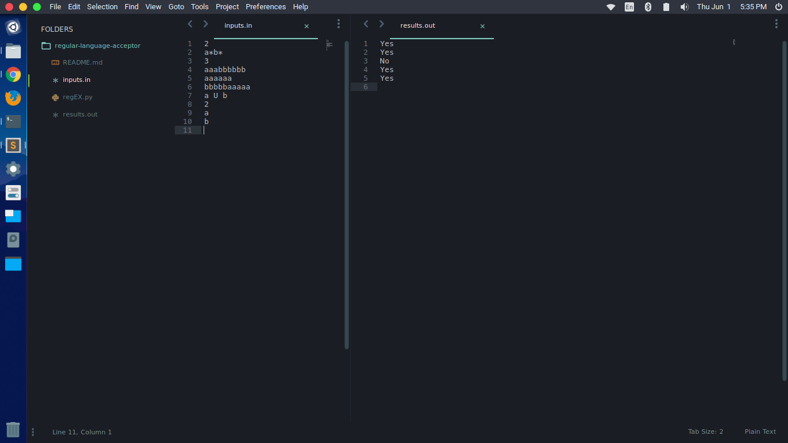

# regular-language-acceptor
A terminal based software written in Python that tells the user if a certain string is generated by a given regular expression. A machine problem on CS 141 - Automata and Language Thoery

## Machine problem specifications
Given a regular expression, determine whether certain strings are generated by it.

The input file consists of a number of lines. The first line contains the number of test cases.  The following lines contain the test cases. Each test case consists of the regular expression, followed by a number representing the number of strings that need to be verified or tested (whether the regular expression generates the string (yes) or not (no). What follows next are the actual strings to be tested.

Sample:

2
a*b*
3
aaabbbbbb
aaaaaa
bbbbbaaaaa
a U b
2
a
b

Sample Output:

yes
yes
no
yes
yes

